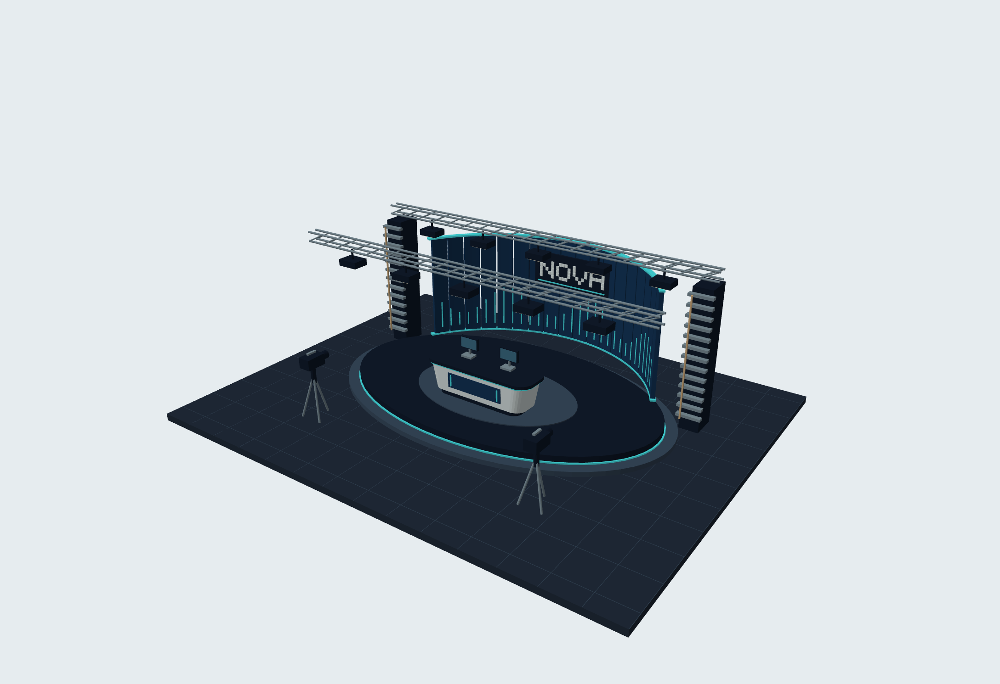
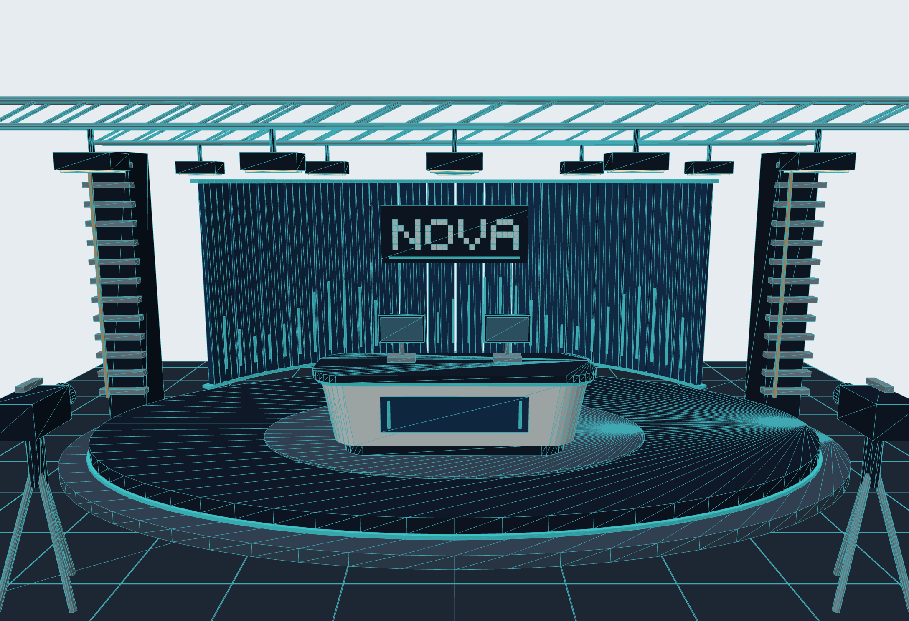
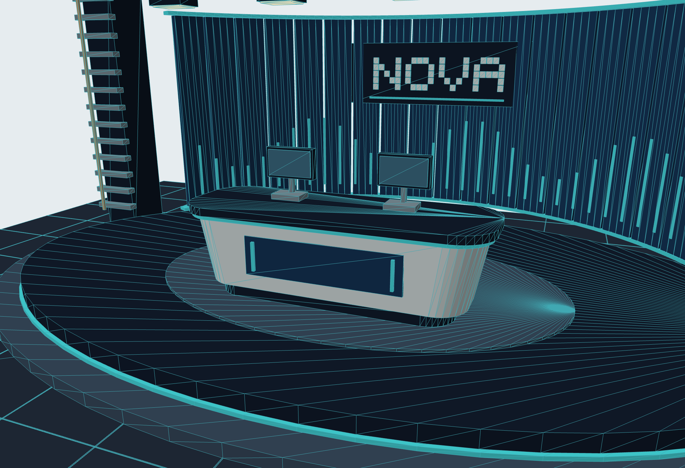
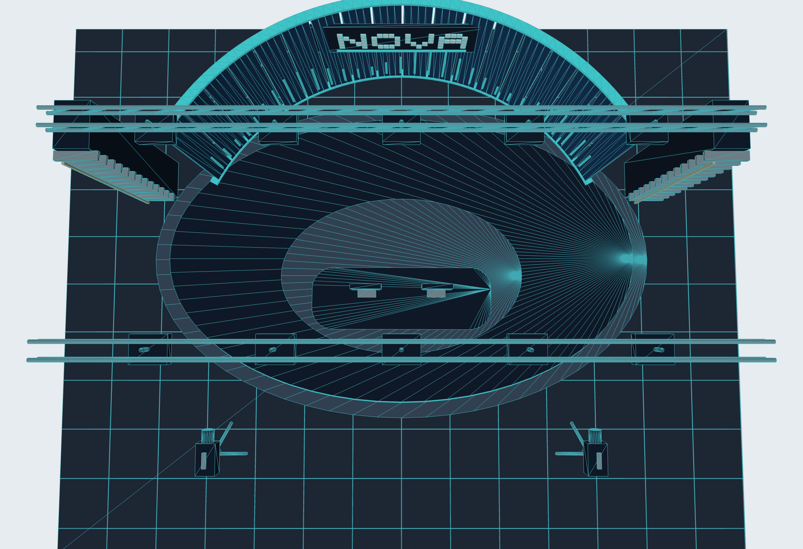

# NOVA Virtual Studio

A compact virtual broadcast studio scene featuring a curved LED backdrop, a rounded anchor desk, a two-level stage, overhead lighting trusses, and camera props. The project combines editable scene geometry, a 3ds Max scene-building script, and a self-contained browser viewer for presentations on macOS or Windows.

**310 objects · 5,304 vertices · 9,368 triangles · 8 scene layers**

## Screenshots

The following images were exported from the interactive browser viewer. They show the project geometry, not 3ds Max renders.

### Studio overview



### Front view with wireframe



### Anchor desk detail



<details>
<summary>Top view and spatial layout</summary>



</details>

## Open the interactive viewer

1. Download the repository using **Code → Download ZIP**, then extract it.
2. Open [`NOVA_Mac_Viewer.html`](NOVA_Mac_Viewer.html) in Safari, Edge, or another WebGL-capable browser.
3. Drag to orbit, scroll to zoom, or use the four camera presets. Toggle scene layers, enable wireframe, and export a PNG of the current view.

The HTML file contains its own model data, renderer, and fallback image. It works offline without a server, external libraries, or an installation step. GitHub's source-file preview does not execute the viewer: download the HTML file and open it locally.

See the [macOS viewing guide](Documentation/MacOS_Viewer_Guide.md) for controls and troubleshooting.

## Build the scene in 3ds Max

1. Save any current work and open a **new, empty scene**.
2. Choose **Scripting → Run Script** and select [`Scripts/Build_NovaStudio.ms`](Scripts/Build_NovaStudio.ms).
3. The script creates editable polygon objects, materials, eight geometry layers, two viewing cameras, and three basic lights. It stops if the scene already contains objects.
4. Use **File → Save As** to save `NovaStudio.max`.
5. Use `F3` to switch shading modes, `F4` to show edges, and `F9` for a draft render. The script configures the built-in Scanline renderer at 1920 × 1080.

The compatibility target is Windows 3ds Max 2022 or later; this has **not been runtime-tested in 3ds Max**. No native `.max` file is included. As a fallback, import [`Models/NovaStudio.obj`](Models/NovaStudio.obj) with its adjacent `.mtl` file, using centimetres and Z-up coordinates, then add cameras and lights manually. Renaming an OBJ file to `.max` does not convert it.

## Scene structure

| Layer | Contents | Modelling concepts |
| --- | --- | --- |
| 01 Architecture | Floor, seams, and decorative towers | Scale, repetition, and spatial layout |
| 02 Stage | Elliptical steps and illuminated trim | Closed profiles and extrusion |
| 03 LED Wall | 18 curved display modules | Arc segments, thickness, and modular construction |
| 04 Screen Graphics | Data bars and NOVA lettering | Geometric graphics and composition |
| 05 Anchor Desk | Rounded body, worktop, and front inset | Profile shaping, taper, and separate components |
| 06 Props | Two monitors | Simplified hard-surface forms |
| 07 Lighting Rig | Trusses and studio lights | Cylindrical members and repeated braces |
| 08 Camera Props | Two cameras and tripods | Primitive assembly and proportions |

Dimensions are in centimetres. The floor is approximately 14 × 11 metres; the lighting rig reaches approximately 4.4 metres. The modelled camera props are separate from the two actual scene cameras.

## Files

```text
NOVA_Mac_Viewer.html          Offline interactive 3D viewer
NOVA_Studio_View*.png         Views exported from the browser viewer
Scripts/Build_NovaStudio.ms   Self-contained 3ds Max scene builder
Models/                      OBJ geometry and MTL materials
Preview/                     Independent software-rendered previews
Documentation/               Viewing guide, modelling exercises, validation
Tools/                       Geometry generator and viewer source
requirements.txt             Python dependencies for regeneration
```

## Rebuild from source

Python 3.10 or later is required for the build scripts. The existing viewer and exported models do not require Python.

```bash
python3 -m pip install -r requirements.txt
python3 Tools/build_studio.py
python3 Tools/build_viewer.py
```

The first command after installation regenerates geometry, MAXScript, validation data, and preview images. The second embeds the geometry and overview preview into the standalone HTML viewer. Neither script replaces the four user-exported `NOVA_Studio_View*.png` screenshots.

## Validation and scope

The mesh validation checks finite coordinates, valid indices, nondegenerate triangles, closed edge topology, consistent edge orientation, and positive signed volume. Results are recorded in [`Documentation/validation.json`](Documentation/validation.json). Embedded JavaScript has passed syntax checking. Browser-view exports are included above; no comprehensive browser compatibility test or 3ds Max runtime test is claimed.

This is a stylized scene study, not a construction-ready studio design. It does not include UV unwrapping, texture baking, calibrated physical lighting, Arnold materials, rigged camera props, or video playback on the screens. The surfaces are triangulated rather than an all-quad production mesh.

## Project provenance

The initial geometry, generation scripts, and viewer were created with AI assistance, without third-party model assets. The [modelling exercises](Documentation/Modelling_Exercises.md) explain how to customize the desk, materials, and camera composition. When presenting this project, distinguish the generated baseline from modifications and software validation you personally completed.

No open-source license has been selected for this repository.
